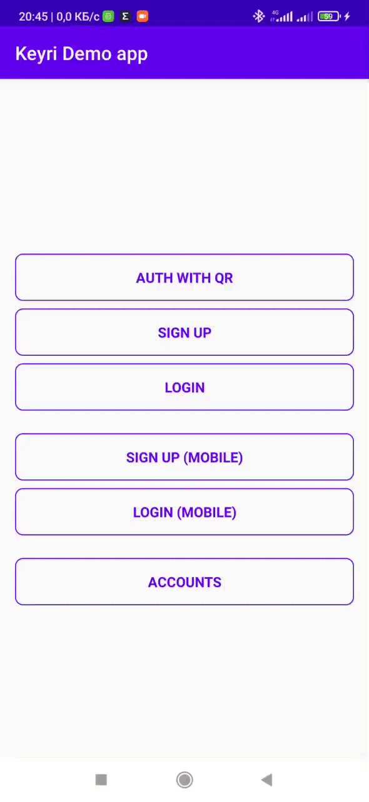

# Overview

This repository contains the open source code for [Keyri](https://keyri.co) Android SDK.


[](https://github.com/Keyri-Co/keyri-android-whitelabel-sdk/releases)



## Contents

* [Requirements](#requirements)
* [Demo](#demo)
* [Integration](#integration)
* [Usage](#usage)
* [License](#license)

## Requirements

* Android API level 23 or higher
* AndroidX compatibility
* Kotlin coroutines compatibility

Note: Your app does not have to be written in kotlin to integrate this SDK, but must be able to
depend on kotlin functionality.

## Demo

This repository contains a demonstration app for the Keyri SDK product. To build and run the demo
app, follow the instructions in
the [demo documentation](https://docs.keyri.co/eyri-Co/keyri-android-whitelabel-sdk/android-integration-guide#demo)
.

## Integration

See
the [integration documentation](https://docs.keyri.co/keyri-android-whitelabel-sdk/android-integration-guide)
in the Keyri Docs.

### Dependencies

* Add the JitPack repository to your root build.gradle file:

```groovy
allprojects {
    repositories {
        // ...
        maven { url "https://jitpack.io" }
    }
}
```

* Add SDK dependency to your build.gradle file and sync project:

```groovy
dependencies {
    // ...
    // SDK with https://api.keyri.co base url (release snapshot):
    implementation 'com.github.Keyri-Co.keyri-android-whitelabel-sdk:keyrisdk:0.9.8'

    // Or if you want to use debug SDK snapshot with https://dev-api.keyri.co base url:
    // implementation 'com.github.Keyri-Co.keyri-android-whitelabel-sdk:keyrisdk-debug:0.9.8'
}
```

### Provisioning Keyri config parameters

Supply these three parameters to your app:

* App Key
* Public Key
* Callback URL

For example:

```groovy
android {
    defaultConfig {
        // ...
        buildConfigField "String", "APP_KEY", "\"raB7SFWt27VoKqkPhaUrmWAsCJIO8Moj\""
        buildConfigField "String", "PUBLIC_KEY", "\"MFkwEwYHKoZIzj0CAQYIKoZIzj0DAQcDQgAE56eKjQNfIbfWYCBQLCF2yV6VySbHMzuc07JYCOS6juySvUWE/ubYvw9pJGAgQfmNr2n4LAQggoapHgfHkTNqbg==\""
        buildConfigField "String", "KEYRI_CALLBACK_URL", "\"http://18.234.222.59:5000/users/session-mobile\""
    }
    // ...
}
```

And then use them to initialize the SDK:

```kotlin
val keyriSdk = KeyriSdk(
    requireContext(),
    KeyriConfig(
        appKey = BuildConfig.APP_KEY,
        publicKey = BuildConfig.PUBLIC_KEY,
        callbackUrl = BuildConfig.KEYRI_CALLBACK_URL,
        allowMultipleAccounts = true
    )
) 
```

Or with koin DI:

```kotlin
val keyriModule = module {
    single {
        KeyriConfig(
            appKey = BuildConfig.APP_KEY,
            publicKey = BuildConfig.PUBLIC_KEY,
            callbackUrl = BuildConfig.KEYRI_CALLBACK_URL,
            allowMultipleAccounts = true
        )
    }
    single { KeyriSdk(get(), get()) }
}
```

## Usage

Note that the SDK object must not be destroyed between calling **onReadSessionId()** and retrieving
the result of authorization methods.

### Option 1: Use the built-in QR login UI/UX

* Add KeyriScannerView in your layout:

```xml
<?xml version="1.0" encoding="utf-8"?>
<LinearLayout xmlns:android="http://schemas.android.com/apk/res/android"
    android:layout_width="match_parent" android:layout_height="match_parent"
    android:orientation="vertical">

    <com.keyrico.keyrisdk.view.KeyriScannerView android:id="@+id/vKeyriScanner"
        android:layout_width="match_parent" android:layout_height="match_parent" />

</LinearLayout>
```

* Init with:

```kotlin
val customArg: String = intent.getStringExtra(KEY_CUSTOM_ARG)

val params = KeyriScannerViewParams(
    activity = this,
    keyriSdk = keyriSdk,
    customArgument = customArg,
    onChooseAccount = { accounts, sessionId, service ->
        // Here init accounts list and call vKeyriScanner.continueAuth(publicAccount, sessionId, service) after item click
        // ... 
    },
    onCompleted = { showToast("Auth completed!") }
)

binding.vKeyriScanner.initView(params)
```

You could check full code
in [AuthWithScannerActivity](app/src/main/java/com/keyri/auth_with_scanner/AuthWithScannerActivity.kt)
.

### Option 2: Build a custom authentication/authorization UI/UX

Alternatively, if you want to provide a custom authentication/authorization UI/UX, use the following
methods:

* **onReadSessionId()** - Call it after retrieving the sessionId from QR-code or deep link.
* **signup()** - Must be called after **onReadSessionId()**. This method is needed to create a user
  for Desktop agent (i.e., if the user does not already have an account and is trying to register).
  Pass username, sessionId, service, and any custom param needed to work with your identity
  management system.
* **login()** - This method needed to login user for Desktop agent. Must be called after
  **onReadSessionId()**. Pass public account identifies (e.g., username), sessionId, service and
  custom param:

```kotlin
val session = keyriSdk.onReadSessionId(sessionId)

if (session.isNewUser) {
    KeyriSdk.signup(
        session.username,
        sessionId,
        session.service,
        CUSTOM_DATA_SIGNUP
    )
} else {
    val account = keyriSdk.accounts().firstOrNull() ?: throw AccountNotFoundException
    keyriSdk.login(account, sessionId, session.service, CUSTOM_DATA_LOGIN)
}
```

* **mobileSignup()** - method to create user on mobile device:

```kotlin
val authResponse = keyriSdk.mobileSignup(username, CUSTOM_DATA_SIGNUP, CUSTOM_HEADERS)

val user = authResponse.user
val refreshToken = authResponse.refreshToken
```

* **mobileLogin()** - method to login user on mobile device:

```kotlin
val authResponse = keyriSdk.mobileLogin(account, CUSTOM_HEADERS)

val user = authResponse.user
val refreshToken = authResponse.refreshToken
```

### Manage Accounts

To manage accounts use the following methods:

* **accounts()** - retrieve all public accounts from storage.
* **removeAccount()** - remove public account from storage.

```kotlin
keyriSdk.accounts().firstOrNull { it.username == "User" && it.custom == "SOME CUSTOM ARG" }
    ?.let { account -> keyriSdk.removeAccount(account) }
```

### Deep Link Handling

To handle deeplinks (e.g., for QR login straight from the user's built-in camera app) you need to
define in your AndroidManifest.xml following intent-filter block:

```xml

<intent-filter android:autoVerify="true">
    <action android:name="android.intent.action.VIEW" />

    <category android:name="android.intent.category.DEFAULT" />
    <category android:name="android.intent.category.BROWSABLE" />

    <data android:host="www.keyri.co" android:pathPrefix="/application" android:scheme="https" />

</intent-filter>
```

This will handle all links with such scheme: [https://www.keyri.co/application?sessionId=324e23]. In
the activity where the processing of links is declared, you need to add handlers in the
**onNewIntent()** and **onCreate()** methods:

```kotlin
override fun onCreate(savedInstanceState: Bundle?) {
    super.onCreate(savedInstanceState)
    setContentView(R.layout.activity_auth)

    intent.data?.let(::processLink)

    initializeUi()
}

override fun onNewIntent(intent: Intent) {
    super.onNewIntent(intent)
    processLink(intent.data)
}

private fun processLink(uri: Uri?) {
    uri?.getQueryParameters("sessionId")?.firstOrNull()?.let { sessionId ->
        // Do auth with sessionId
    } ?: Log.e("Keyri", "Failed to process link")
}
```

The last thing you need to do in order for your deep links to be processed is to create the
associations for each of the declared hosts for handling in JSON file as described
here: [https://developer.android.com/training/app-links/verify-site-associations].

## License

In development.
